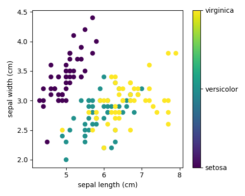

## Supervised Learning
[[Supervised Learning]]
$P(Y|X)$
- Classification
$Y$ is discrete, $X$ is whatever

- Regression
$Y$ is continuous, $X$ is whatever

## Unsupervised Learning
$P(X)$
- Clustering

	- New feature: Cluster(discrete)

- Dimension reduction
	- Removal of feature
- Feature Extraction
	- New feature: continous
	- "Project" the space to a new one

## Interpolation
